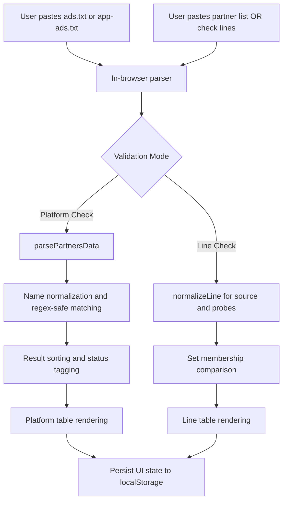

# Ads.txt Checker & Line Matcher

A privacy-first, browser-native validation utility for auditing `ads.txt` and `app-ads.txt` authorization data against partner lists and canonical line entries.

[](LICENSE)
[](https://github.com/OstinUA/Matcher-ads.txt-app-ads.txt/commits)
[](https://github.com/OstinUA/Matcher-ads.txt-app-ads.txt)
[](index.html)

> [!NOTE]
> This tool is implemented as a single static page and performs all parsing and matching operations in the client browser.

## Table of Contents

- [Features](#features)
- [Tech Stack & Architecture](#tech-stack--architecture)
  - [Core Technologies](#core-technologies)
  - [Project Structure](#project-structure)
  - [Key Design Decisions](#key-design-decisions)
- [Getting Started](#getting-started)
  - [Prerequisites](#prerequisites)
  - [Installation](#installation)
- [Testing](#testing)
- [Deployment](#deployment)
- [Usage](#usage)
- [Configuration](#configuration)
- [License](#license)
- [Support the Project](#support-the-project)

## Features

- Client-side validation workflow for both `ads.txt` and `app-ads.txt` files.
- Platform-oriented reconciliation of SSP partner records against a pasted authorization source.
- Flexible parser for partner inputs:
  - Supports row blocks (`id`, `name`, `type`, `env`, `status`).
  - Supports tab-delimited and multi-space-delimited data copied from spreadsheets.
- Intelligent partner matching:
  - Cleans partner names (including parenthetical suffix removal).
  - Escapes regex special characters for safe lookup.
  - Counts occurrences in the target authorization document.
- Source metadata visibility for partner rows:
  - Partner type (`oRTB`, etc.).
  - Environment context (`In-app`, etc.).
  - Source lifecycle status (`Active`, etc.).
- Toggleable output mode for platform checks:
  - Default focused mode shows only active/found matches.
  - “Full information” mode reveals all evaluated records, including missing entries.
- Line-level exactness checks:
  - Normalizes comma-separated fields.
  - Ignores whitespace differences.
  - Ignores inline comments after `#`.
  - Performs case-insensitive matching.
- High-signal result views with status color coding (`FOUND` / `MISSING`).
- Auto-persisted workspace via `localStorage`, including text areas and toggle state.
- Zero backend dependencies and no server-side data transfer.

> [!IMPORTANT]
> Since all content is processed locally, sensitive deal IDs or partner metadata never leave the browser session unless you explicitly share them.

## Tech Stack & Architecture

### Core Technologies

- `HTML5` for semantic structure and single-page UI layout.
- `CSS3` for responsive-ish two-column workspace and result table styling.
- Vanilla `JavaScript (ES6+)` for parser/matcher logic and UI state transitions.
- Browser `localStorage` API for session persistence.

### Project Structure

```text
Matcher-ads.txt-app-ads.txt/
├── .github/
│   └── FUNDING.yml
├── index.html
├── LICENSE
└── README.md
```

### Key Design Decisions

1. **Single-file application architecture**
   - Keeps onboarding minimal (no bundlers, no dependency graph).
   - Enables instant usage with static hosting or direct file opening.

2. **Deterministic normalization pipeline**
   - Line checks normalize both source and probe lines before comparison.
   - This mitigates false negatives caused by formatting inconsistencies.

3. **Dual-mode partner parser**
   - Detects spreadsheet-like tabular data and structured block data.
   - Improves interoperability with AdOps workflows and copied partner exports.

4. **Regex-safe name matching**
   - Partner names are escaped before search regex creation.
   - Prevents accidental regex interpretation from special characters.

5. **Client-side persistence over remote state**
   - `localStorage` keeps recent input without introducing auth/session complexity.



> [!TIP]
> For repeat audits, keep the browser tab open and iterate on partner input only. The app persists prior content, reducing repetitive paste/setup time.

## Getting Started

### Prerequisites

- Any modern browser (`Chrome`, `Edge`, `Firefox`, `Safari`).
- Optional local static server for predictable local-origin behavior.
- Optional `Node.js >= 18` if you want to run linting helpers via `npx`.

### Installation

1. Clone the repository:

```bash
git clone https://github.com/OstinUA/Matcher-ads.txt-app-ads.txt.git
cd Matcher-ads.txt-app-ads.txt
```

2. Launch locally (choose one):

```bash
# Option A: open directly
open index.html
```

```bash
# Option B: serve over HTTP (recommended)
python3 -m http.server 8080
# then open http://localhost:8080
```

## Testing

> [!NOTE]
> The repository currently does not ship with a formal automated unit/integration test suite.

Recommended validation workflow:

```bash
# Static page smoke check
python3 -m http.server 8080
```

```bash
# Optional HTML linting
npx --yes htmlhint index.html
```

```bash
# Optional formatting check (if Prettier is preferred locally)
npx --yes prettier --check README.md index.html
```

Manual functional checks:

1. Paste a known `ads.txt` sample and a known partner dataset.
2. Confirm `FOUND/MISSING` outcomes for expected partners.
3. Toggle `Full information` and verify visibility changes.
4. Run line checks with intentionally varied spacing/case/comments.

## Deployment

Because this is a static front-end utility, deployment is straightforward:

- Host `index.html` on any static host (`GitHub Pages`, `Netlify`, `Vercel static`, `S3 + CloudFront`, internal web servers).
- Set aggressive cache headers only when release versioning is in place.
- Prefer immutable deployment paths or cache-busting query/version strategy.

Example Docker-based static serving:

```dockerfile
FROM nginx:stable-alpine
COPY index.html /usr/share/nginx/html/index.html
EXPOSE 80
```

```bash
docker build -t ads-txt-checker .
docker run --rm -p 8080:80 ads-txt-checker
```

> [!WARNING]
> If deployed in a shared workstation environment, remember `localStorage` persists per browser profile. Clear browser storage after handling sensitive partner data.

## Usage

### 1) Platform Check Mode

```text
1. Paste your primary ads authorization file into the top textarea.
2. Open the Platform Check tab.
3. Paste SSP partner rows (block format or tabular format).
4. Click "Check Platforms".
5. Review type/env/source-status context with FOUND/MISSING and count.
```

### 2) Line Check Mode

```text
1. Keep the main ads/app-ads input populated.
2. Switch to Line Check.
3. Paste one candidate line per row.
4. Click "Check Lines".
5. Validate normalized exact-match results.
```

### Input Pattern Examples

```txt
# Block format example
1
Google
oRTB
In-app
Active

2
ExampleExchange
oRTB
Web
Inactive
```

```txt
# Candidate line examples (one per row)
google.com, pub-123456789, DIRECT, f08c47fec0942fa0
example.com,pub-00001,reseller
```

> [!CAUTION]
> Partner matching in Platform Check is name-based occurrence matching, not canonical `ads.txt` field validation. Use Line Check for strict row-level verification.

## Configuration

This project does not require `.env` files, runtime flags, or external configuration files.

### Runtime Behavior Controls

- UI toggle:
  - `Full information` (`showMissingToggle`) controls whether all rows are shown or only active/found rows.
- Persistence keys in `localStorage`:
  - `adsInput`
  - `partnersInput`
  - `checkLinesInput`
  - `showMissingToggle`

### Operational Notes

- Clearing persisted state:

```js
localStorage.removeItem("adsInput");
localStorage.removeItem("partnersInput");
localStorage.removeItem("checkLinesInput");
localStorage.removeItem("showMissingToggle");
```

## License

This project is licensed under the `Apache License 2.0`. See [`LICENSE`](LICENSE) for the full text.

## Support the Project

[](https://www.patreon.com/OstinFCT)
[](https://ko-fi.com/fctostin)
[](https://boosty.to/ostinfct)
[](https://www.youtube.com/@FCT-Ostin)
[](https://t.me/FCTostin)

If you find this tool useful, consider leaving a star on GitHub or supporting the author directly.
