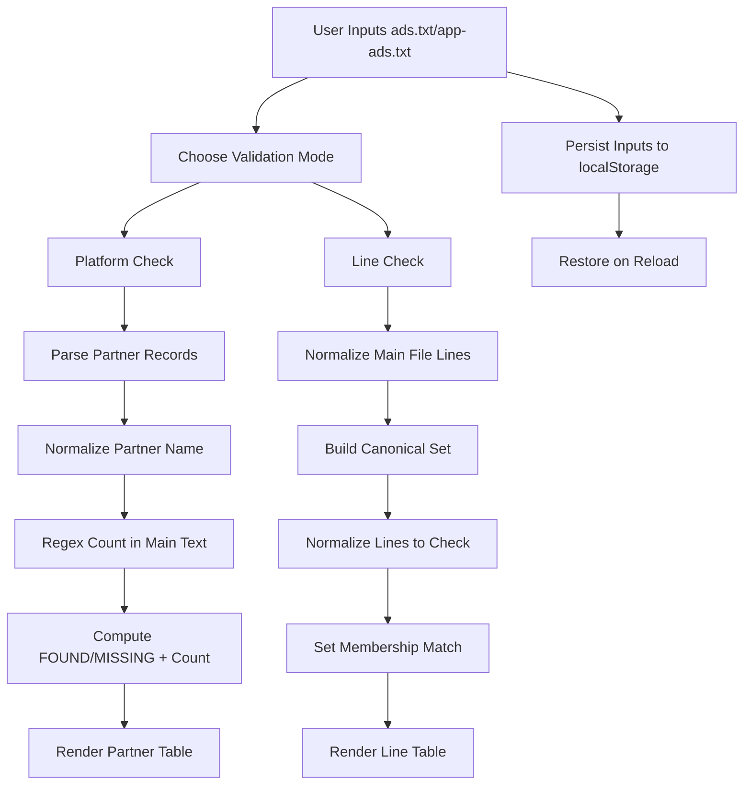

# Ads.txt Checker & Line Matcher

A zero-backend, privacy-first browser utility for validating `ads.txt` and `app-ads.txt` authorization data against SSP partner lists and explicit line-level assertions.

[](./index.html)
[](./README.md)
[](LICENSE)
[](./index.html)

> [!NOTE]
> This project is implemented as a single static HTML file (`index.html`) with embedded CSS and JavaScript. No server, API, or external storage is required.

## Table of Contents

- [Features](#features)
- [Tech Stack & Architecture](#tech-stack--architecture)
  - [Core Stack](#core-stack)
  - [Project Structure](#project-structure)
  - [Key Design Decisions](#key-design-decisions)
- [Getting Started](#getting-started)
  - [Prerequisites](#prerequisites)
  - [Installation](#installation)
- [Testing](#testing)
- [Deployment](#deployment)
- [Usage](#usage)
- [Configuration](#configuration)
- [License](#license)
- [Support the Project](#support-the-project)

## Features

- Dual validation workflows for monetization QA:
  - **Platform Check** validates SSP partner names against the provided `ads.txt` / `app-ads.txt` payload.
  - **Line Check** performs exact semantic matching of full authorization lines.
- Flexible SSP partner ingestion:
  - Supports ID-grouped list input (multi-line blocks).
  - Supports tab-delimited and multi-space tabular paste from spreadsheets.
- Match quality controls:
  - Tracks partner occurrence counts in the authorization text.
  - Sorts results by descending match frequency for quick triage.
- Operational filtering:
  - Optional “Full information” toggle to display full dataset.
  - Default behavior prioritizes `Active` + `Found` partner rows.
- Line normalization pipeline:
  - Removes comments (everything after `#`).
  - Trims token spacing around comma-separated fields.
  - Applies case-insensitive canonical matching.
- Client-side persistence with `localStorage`:
  - Saves primary authorization content, partner list, line checks, and UI toggle state.
  - Restores inputs automatically after page refresh.
- Privacy by design:
  - All parsing and comparison run in-browser.
  - No network calls, no telemetry, no data exfiltration.

> [!IMPORTANT]
> This tool is intended for validation and reconciliation workflows. It does **not** mutate, publish, or host `ads.txt` / `app-ads.txt` content.

## Tech Stack & Architecture

### Core Stack

- **HTML5** for document structure and UI layout.
- **CSS3** for responsive layout, table rendering, status indicators, and tab UI.
- **Vanilla JavaScript (ES6+)** for state management, parsing, normalization, and match computation.
- **Browser APIs**:
  - `localStorage` for persistent local state.
  - DOM APIs for rendering tab state and validation result tables.

### Project Structure

```text
Matcher-ads.txt-app-ads.txt/
├── index.html      # Complete app: markup, styling, and logic
├── README.md       # Project documentation
└── LICENSE         # Open-source license
```

### Key Design Decisions

1. **Single-file architecture**
   - Reduces operational complexity.
   - Makes onboarding trivial for non-engineering AdOps teams.
   - Enables offline usage when opened locally.

2. **In-browser execution model**
   - Eliminates backend infrastructure and hosting requirements.
   - Preserves confidentiality of potentially sensitive monetization relationships.

3. **Normalization-first matching**
   - Decreases false negatives caused by whitespace, casing, and comments.
   - Maintains deterministic behavior for line-level validation.

4. **User-centric result triage**
   - Status highlighting (`FOUND` / `MISSING`) is optimized for rapid visual scanning.
   - Partner results include metadata (`Type`, `Env`, `Source Status`, `Count`) for context-rich decisions.

#### Validation Pipeline (Mermaid)



> [!TIP]
> Use the Platform Check for broad partner compliance audits, and Line Check for incident-driven verification (e.g., confirming specific reseller/direct declarations).

## Getting Started

### Prerequisites

- A modern browser (latest stable `Chrome`, `Edge`, `Firefox`, or `Safari`).
- Git (optional, only required if cloning).
- No runtime dependencies (`Node.js`, `Python`, Docker, etc.) are required.

### Installation

1. Clone the repository:

```bash
git clone https://github.com/OstinUA/Matcher-ads.txt-app-ads.txt.git
cd Matcher-ads.txt-app-ads.txt
```

2. Run locally by opening `index.html`:

```bash
# Option A: open directly in your browser
xdg-open index.html  # Linux
open index.html      # macOS
start index.html     # Windows (PowerShell/cmd)
```

3. Optional: serve over local HTTP (recommended for uniform behavior):

```bash
python3 -m http.server 8080
# Then open http://localhost:8080
```

> [!WARNING]
> If your organization applies strict browser policies, direct `file://` access may restrict some behaviors. In that case, prefer local HTTP serving.

## Testing

This repository does not currently include an automated test harness. Validation is primarily functional/manual.

Recommended checks:

```bash
# Lint markdown documentation (if markdownlint is available)
npx markdownlint-cli README.md

# Validate HTML syntax and common issues (if htmlhint is available)
npx htmlhint index.html

# Run a local server and perform manual smoke tests
python3 -m http.server 8080
```

Manual test checklist:

1. Paste a valid `ads.txt` payload and an SSP dataset.
2. Run **Platform Check** and verify `FOUND`/`MISSING` rows and counts.
3. Toggle **Full information** and confirm row filtering behavior.
4. Switch to **Line Check**, paste candidate lines, and validate match statuses.
5. Refresh page and confirm state restoration via `localStorage`.

## Deployment

Because this is a static application, deployment is straightforward:

- **Static hosting targets**: GitHub Pages, Netlify, Vercel (static mode), S3 + CloudFront, Nginx.
- **Artifact**: deploy `index.html` (plus `README.md` and `LICENSE` optionally).
- **No build step required**.

### Minimal CI/CD Strategy

1. On push to `main`, run lightweight checks (Markdown + HTML lint).
2. Publish static files to your chosen host.
3. Invalidate CDN cache if applicable.

Example GitHub Pages approach:

- Enable Pages for the repository.
- Serve from root branch (`/`), or move files into `/docs` and configure Pages accordingly.

> [!CAUTION]
> This tool validates content but does not guarantee business compliance with every SSP requirement. Always align results with your contractual and policy obligations.

## Usage

### 1) Platform Check Workflow

1. Paste full `ads.txt` or `app-ads.txt` content into the main input.
2. Paste SSP partner data in either grouped format or tabular format.
3. Click `Check Platforms`.
4. Review output columns:
   - `Partner`
   - `Type`
   - `Env`
   - `Source Status`
   - `App|Ads.txt Status`
   - `Count`

Example partner input (grouped):

```text
1
Google
oRTB
In-app
Active

2
Adsolut
SDK
Web
Inactive
```

### 2) Line Check Workflow

1. Paste full `ads.txt`/`app-ads.txt` in the main input.
2. Add one expected authorization line per row in `Check lines`.
3. Click `Check Lines`.
4. Inspect `FOUND`/`MISSING` result statuses.

Example lines to validate:

```text
google.com, pub-1234567890123456, DIRECT, f08c47fec0942fa0
rubiconproject.com, 12345, RESELLER, 0bfd66d529a55807
```

### 3) Normalization Behavior (Reference)

```javascript
// Conceptual behavior used by the checker:
// 1) Strip comments after '#'
// 2) Split by ',' and trim each token
// 3) Re-join in canonical form and lower-case for matching
const canonical = line
  .split('#')[0]
  .split(',')
  .map((p) => p.trim())
  .filter(Boolean)
  .join(', ')
  .toLowerCase();
```

## Configuration

The application has no external config file, but runtime behavior is influenced by browser state and input formats.

### Persisted Keys (`localStorage`)

- `adsInput`: raw primary authorization file text.
- `partnersInput`: raw SSP partner dataset.
- `checkLinesInput`: raw candidate lines for line-level check.
- `showMissingToggle`: boolean flag controlling table detail mode.

### Input Contract Expectations

- `adsInput`:
  - Accepts newline-delimited entries from an `ads.txt`/`app-ads.txt` file.
  - Supports comment lines and inline comments.
- `partnersInput`:
  - Accepts either grouped records (`id -> name -> type -> env -> status`) or tab-delimited rows.
- `checkLinesInput`:
  - Expects one candidate authorization line per line.

### Startup/Environment Flags

- No CLI flags.
- No `.env` variables.
- No build-time configuration required.

## License

This project is licensed under the **MIT License**. See `LICENSE` for full legal text.

## Support the Project

[](https://www.patreon.com/OstinFCT)
[](https://ko-fi.com/fctostin)
[](https://boosty.to/ostinfct)
[](https://www.youtube.com/@FCT-Ostin)
[](https://t.me/FCTostin)

If you find this tool useful, consider leaving a star on GitHub or supporting the author directly.
